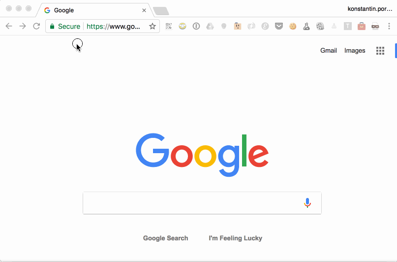
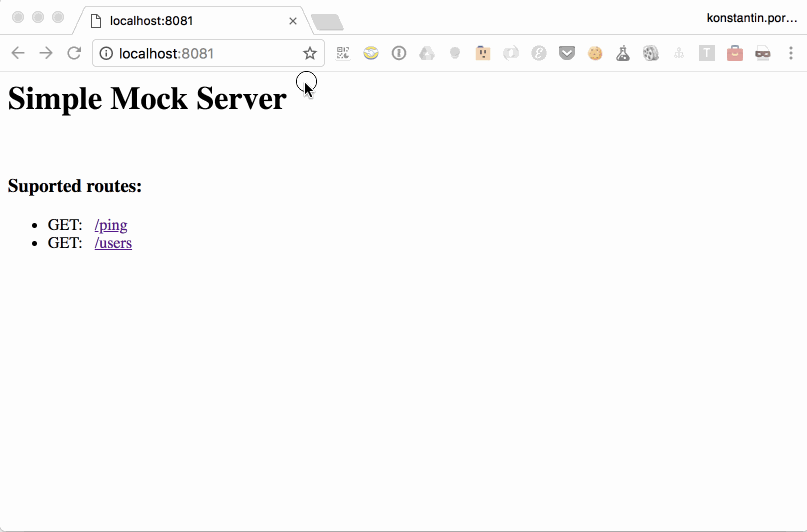

# Mock Server

- ✅ `JSON` and `ping` example included 
- ✅ Customizable 

## Requirements

- **Node.js** >= `v6.10.0`
- **npm** >= `3.10.10`

## Installation

1. Install dependencies

  ```
  $ npm install
  ```

## Run

```terminal
$ npm start
```

And now just navigate to http://localhost:8081

## How to force server to re-lunch if files were modified?

1. Install [Nodemon](https://github.com/remy/nodemon)
  
  ```terminal
  $ npm install -g nodemon
  ```

2. Run script

  ```terminal
  $ nodemon app.js
  ```

# Example Mocks

- **Get** `/ping`
- **Get** `/users`

| |
|---|
|  |

# How to add another mocked endpoint?

## JSON response

1. Create file with json-response and save in into `./mocks`:  

    ```terminal
    $ echo '{ "message": "Hello, World!" }' >> ./mocks/hello-world.json
    ```

2. Add new endpoint to `app.js`:
    
    ```js
    app.get('/hello', function(req, res) {
      ExpressUtils.jsonRouteToFile('./mocks/hello-world.json', req, res);
    });
    ```  
    
    Where `/hello` it's new endpoitn name.
    And `./mocks/hello-world.json` is path to the file with new response.

3. Run  

    ```terminal
    $ npm start
    ```

| |
|---|
|  |

## Other responses

You can add any response using feature of [Express](http://expressjs.com/en/starter/hello-world.html)
